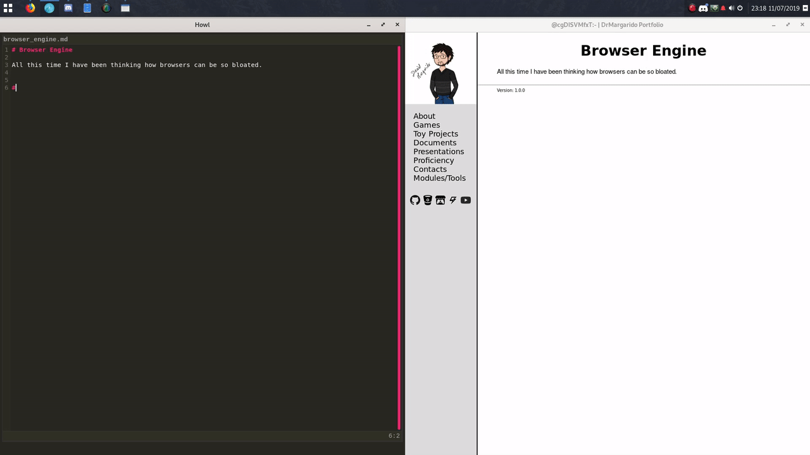

# Surf Monitor - Live Previewer

This project aims to provide a way to have a browser react to changes in a list of files to monitor and update what he is displaying instantly.

## Demo



To see a full demo check the [video](https://youtu.be/wPPut1VDIj4).


## Dependencies

You will need to build it from source. The source is the lit file, a file that following the ideas of [Literate Programming](https://www-cs-faculty.stanford.edu/~knuth/lp.html).

I used the [Literate](https://github.com/zyedidia/Literate) compiler to compile the lit file.

The browser I used was the [surf](https://surf.suckless.org/) browser from the suckless guys.

To detect changes made in files inotifywait is used, so you will need to install the **inotify-tools** package.

#### ArchLinux
```sh
sudo pacman -S inotify-tools
```

#### Debian
```sh
sudo apt-get install inotify-tools
```

## Installation

To install the surf_monitor follow the next steps:

1. Get the surf_monitor repository
```sh
git clone https://github.com/drmargarido/surf_monitor
```

2. Download the Lit compiler(Here is the linux version, select the one for your os)
```sh
wget http://literate.zbyedidia.webfactional.com/binaries/literate-linux64.tar.gz && tar xf literate-linux64.tar.gz && rm literate-linux64.tar.gz
```

3. Download, compile and install the surf browser
```sh
git clone https://git.suckless.org/surf
cd surf
make
sudo make install
cd ..
```

4. Compile and Install the surf monitor
```sh
make
sudo make install
```

Everything ready now. Check the documentation generated from the literate program in the build folder.

To check if everything is working fine try to open the documentation with the surf monitor, and make some change in the html while the browser is open to check if it reloads.
```sh
surf_monitor build/surf_monitor.html build
```

## Usage

You can run the surf monitor in the following way:
```
surf_monitor :html_file_to_open: ":path_to_monitor:"
```
